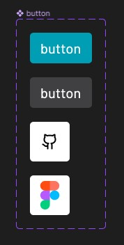
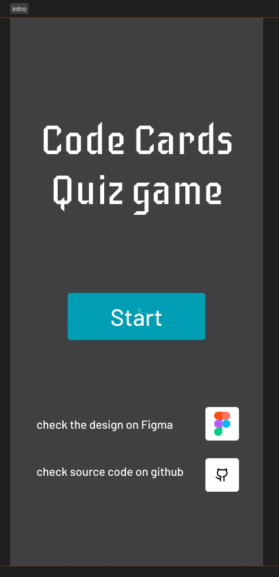
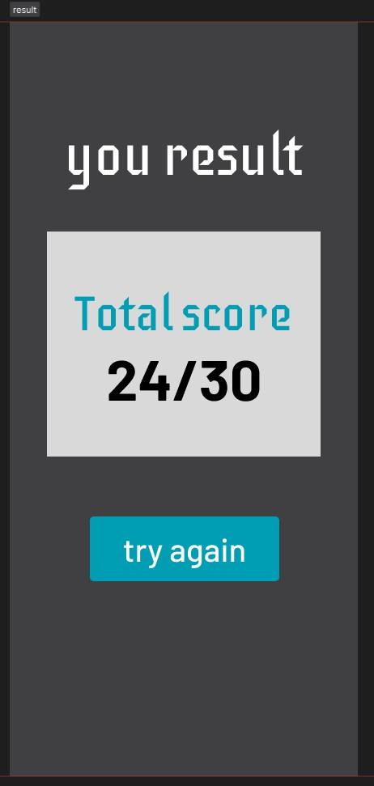

# Contents

- [Contents](#contents)
  - [code cards](#code-cards)
  - [tech](#tech)
  - [design source](#design-source)

## code cards

An application for testing and training programmers based on JavaScript that works perfectly on mobile phones

## tech

We have used the following technology in building the application:

1. Html
2. CSS
3. [react](https://ionicframework.com/)
4. [ionicframework](https://ionicframework.com/)
5. [figma](https://www.figma.com/)

## design source

you can check the figma source [here](https://www.figma.com/file/YC05QHHI8B1amHqsrHrYO7/code-card-app?node-id=0%3A1&t=rRXQ644zQ2ANFzaI-1)

and here is some screenshots from the design

